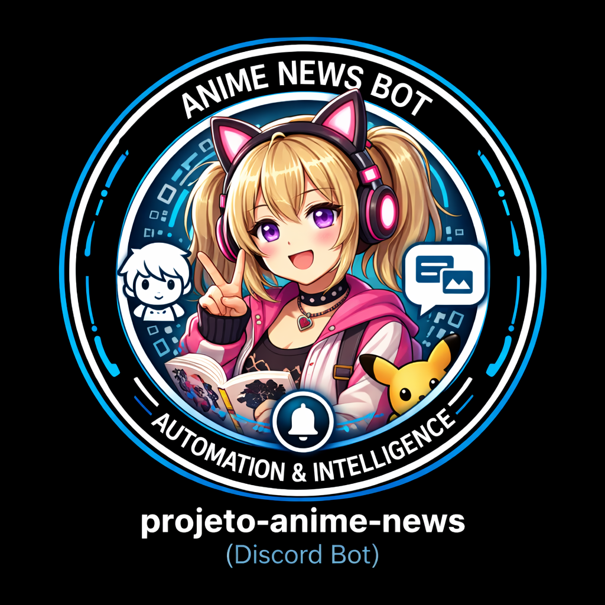

# 🗞️ AnimeBootNews — Seu Bot de Notícias de Anime

<p align="center">
  
</p>

<div align="center">

[](https://discord.com/developers/applications)
[](https://www.python.org/)
[](https://github.com)
[](LICENSE)
[](https://github.com)
[](docs/SECURITY.md)
[](#-guia-completo)
[](#-sistema-multi-idioma)
[](requirements.txt)
[](Dockerfile)

**Monitoramento inteligente de feeds RSS/Atom/YouTube focado exclusivamente em ANIMES**

Filtragem automática de Games, Merch e Roupas • Dashboard Interativo • Postagem em Tempo Real • Multi-Idioma

[📖 Documentação](#-guia-completo) • [🐛 Reportar Bug](https://github.com) • [💡 Sugerir Feature](https://github.com)

</div>

---

## ✨ Funcionalidades Principais

| 🎯 Feature | 📝 Descrição | 🔧 Configurável |
|-----------|-----------|-----------------|
| 📡 **Scanner Automático** | Varredura de feeds RSS/Atom/YouTube a cada 24 horas | ✅ Sim |
| 🛡️ **Filtro Anti-Merch** | Bloqueia automaticamente games, brinquedos, roupas e figures | ✅ Customizável |
| 🎯 **Categorias Inteligentes** | Anime, News e Música (OSTs/Openings) | ✅ Ativável |
| 🎛️ **Dashboard Persistente** | Painel interativo que funciona mesmo após restart | ✅ Multi-Guild |
| 🔄 **Deduplicação Avançada** | Histórico em `history.json` - nunca repete notícias | ✅ Automático |
| 🌐 **Multi-Guild Support** | Configuração independente por servidor Discord | ✅ Suportado |
| 📝 **Logs Estruturados** | Logs estruturados (JSON) com auditoria em `audit.json` | ✅ Sempre Ativo |
| 🛡️ **Segurança & GRC** | Rate limiting, validação de entrada e política completa em `docs/SECURITY.md` | ✅ Endurecido |
| 🎞️ **Player Nativo** | Vídeos do YouTube/Twitch tocam direto no Discord | ✅ Integrado |
| 🌍 **Multi-Idioma** | Suporte a EN, PT-BR, ES, IT (detecção automática) | ✅ 4 idiomas |
| 🖥️ **Web Dashboard** | Painel visual em `http://localhost:8080` com status real | ✅ REST API |
| 🔐 **Persistência de Estado** | Salva configurações em JSON estruturado | ✅ Seguro |
| ⚡ **Async/Await** | I/O não-bloqueante com `asyncio` e `discord.py` | ✅ Otimizado |

---

## 🎯 Casos de Uso

### 📺 Servidor de Anime

```
✅ Receber notícias de novos episódios
✅ Atualizações de produção de estúdios
✅ Trailers e PVs de séries futuras
❌ Bloqueia automaticamente: Games, Merchandising, Roupas
```

### 🎵 Comunidade de Música

```
✅ Novos OSTs e Openings
✅ Composições de estúdios de áudio
✅ Lançamentos de trilhas sonoras
❌ Filtra conteúdo não-musical automaticamente
```

### 🌍 Servidor Internacional

```
✅ Suporte a múltiplos idiomas
✅ Configuração por canal independente
✅ Dashboard em qualquer idioma configurado
✅ Tradução automática com deep-translator
```

---

## 🧱 Arquitetura Técnica

### 🧩 Visão Geral (Mermaid)

```mermaid
flowchart LR
    subgraph Inputs[Fontes de Notícias]
        RSS[RSS / Atom Feeds]
        YT[YouTube Channels]
    end

    subgraph Core[Core Scanner]
        SCAN[APScheduler\nScanner]
        PIPE[Pipeline de\nProcessamento]
        FILTER[Filtros & Classificação]
        TRANS[Tradução]
    end

    subgraph DiscordSide[Discord Bot]
        DASH[Dashboard & Views]
        COGS[Cogs\n(/status, /feeds,\n/audit, /audit_stats)]
    end

    subgraph Web[Web Dashboard]
        WEB[aiohttp + Jinja2]
        API[REST API /api/*]
    end

    Inputs --> SCAN --> PIPE --> FILTER --> TRANS --> DiscordSide
    DiscordSide --> WEB
    PIPE -->|Histórico / Cache| Storage[(JSON\nconfig/history/state)]
    PIPE -->|Auditoria| Audit[(audit.json)]
```

### 📊 Diagrama de Componentes (ASCII)

```
┌─────────────────────────────────────────────────────────────────┐
│                         CAMADA DE ENTRADA                        │
│  ┌──────────────┐  ┌──────────────┐  ┌──────────────┐           │
│  │  RSS Feeds   │  │  Atom Feeds  │  │ YouTube API  │           │
│  └──────┬───────┘  └──────┬───────┘  └──────┬───────┘           │
│         └──────────────────┴──────────────────┘                  │
└─────────────────────────┬──────────────────────────────────────┘
                          │
┌─────────────────────────▼──────────────────────────────────────┐
│                    CORE SCANNER (APScheduler)                   │
│  • Executa a cada 24 horas                                   │
│  • Realiza requisições assíncronas                             │
│  • Normaliza formatos de feed                                  │
└─────────────────────────┬──────────────────────────────────────┘
                          │
┌─────────────────────────▼──────────────────────────────────────┐
│              PIPELINE DE PROCESSAMENTO                          │
│  ┌──────────────────────────────────────────────────┐          │
│  │ 1. Parsing com feedparser                        │          │
│  │ 2. Normalização de dados                         │          │
│  │ 3. Deduplicação (history.json)                   │          │
│  │ 4. Filtragem com Regex + Keyword Blocking        │          │
│  │ 5. Tradução automática (deep-translator)         │          │
│  │ 6. Categorização (Anime/News/Music)              │          │
│  └──────────────────────────────────────────────────┘          │
└─────────────────────────┬──────────────────────────────────────┘
                          │
        ┌─────────────────┴─────────────────┐
        │                                   │
┌───────▼────────────┐         ┌───────────▼──────────┐
│  ✅ APROVADO       │         │  ❌ BLOQUEADO        │
│  • Postagem        │         │  • Lixo (Ignorado)  │
│  • Discord Embed   │         │  • Log registrado   │
│  • Histórico       │         │                      │
└───────┬────────────┘         └──────────────────────┘
        │
┌───────▼──────────────────────────────────────────────────────┐
│            INTEGRAÇÃO COM DISCORD                            │
│  ┌────────────────┐  ┌─────────────────┐  ┌──────────────┐  │
│  │ POST em CANAL  │  │ Dashboard View  │  │ Player Video │  │
│  └────────────────┘  └─────────────────┘  └──────────────┘  │
└───────┬──────────────────────────────────────────────────────┘
        │
┌───────▼──────────────────────────────────────────────────────┐
│            WEB DASHBOARD (aiohttp + Jinja2)                  │
│  http://localhost:8080                                       │
│  • Status em tempo real                                      │
│  • Estatísticas                                              │
│  • Configuração remota                                       │
└──────────────────────────────────────────────────────────────┘
```

### 🔄 Fluxo de Dados Detalhado

```
INÍCIO DO CICLO (a cada 24h)
    │
    ├─► [APScheduler] Dispara start_scheduler()
    │
    ├─► [Scanner] Carrega sources.json
    │   └─► config.json, history.json, state.json
    │
    ├─► [Fetcher] Requisições paralelas (aiohttp)
    │   ├─► RSS/Atom com feedparser
    │   ├─► YouTube com requests
    │   └─► Timeout: 15s por feed
    │
    ├─► [Normalizer] Converte para formato padrão
    │   ├─► Extrai: título, URL, descrição, data
    │   ├─► Formata datas (ISO 8601)
    │   └─► Remove HTML/XML
    │
    ├─► [Deduplicator] Checa history.json
    │   ├─► Hash do título
    │   ├─► Compare com últimas 500 notícias
    │   └─► Se encontrada → Skip
    │
    ├─► [FilterEngine] Pipeline de filtros
    │   ├─► 1º: Verificar blacklist_keywords (REGEX)
    │   │   ├─ "game", "ps5", "xbox", etc
    │   │   ├─ "figure", "statue"
    │   │   ├─ "t-shirt", "apparel", "clothing"
    │   │   └─ Se MATCH → Rejeita ❌
    │   │
    │   ├─► 2º: Verificar categoria ativa
    │   │   ├─ config.json[guild_id]["filters"]
    │   │   ├─ Se "anime" desativado → Skip
    │   │   └─ Se "music" ativado → Check
    │   │
    │   └─► 3º: Validar comprimento mínimo
    │       └─ Título < 3 caracteres = Rejeita
    │
    ├─► [Translator] Tradução automática (se necessário)
    │   ├─► Detecta idioma original
    │   ├─► Usa config.json[guild_id]["language"]
    │   ├─► deep-translator (Google Translate)
    │   └─► Timeout: 10s
    │
    ├─► [Formatter] Cria Discord Embed
    │   ├─► Title, Description, Image
    │   ├─► Thumbnail (favicon do site)
    │   ├─► Footer com timestamp
    │   └─► Color por categoria
    │
    ├─► [Publisher] Posta no Discord
    │   ├─► Busca guild_id e channel_id
    │   ├─► await channel.send(embed=embed, view=PlayerView)
    │   └─► Trata erros (channel não encontrado, etc)
    │
    └─► [Logger] Registra resultado
        ├─► Sucesso: "✅ Posted: [título]"
        ├─► Bloqueado: "🚫 Blocked (keyword): [título]"
        ├─► Duplicado: "🔄 Duplicate: [título]"
        └─► Erro: "❌ Error: [mensagem]"

SALVA ESTADO
    ├─► history.json += [novo_id]
    ├─► state.json atualiza timestamp
    └─► Aguarda próximo ciclo (24h)
```

### 💾 Estrutura de Dados

#### `sources.json` - Feeds Configurados

```json
{
  "youtube_feeds": {
    "anime_studios": [
      "https://www.youtube.com/feeds/videos.xml?channel_id=MAPPA",
      "https://www.youtube.com/feeds/videos.xml?channel_id=UFOTABLE"
    ],
    "anime_news": [
      "https://www.youtube.com/feeds/videos.xml?channel_id=CRUNCHYROLL"
    ]
  },
  "rss_feeds": {
    "anime_news": [
      "https://example.com/anime/rss.xml",
      "https://example.com/news/atom.xml"
    ]
  }
}
```

#### `config.json` - Configuração por Guild

```json
{
  "417746665219424277": {
    "filters": ["anime", "news", "music"],
    "channel_id": 1123627917642047548,
    "language": "pt_BR",
    "enabled": true
  },
  "OTHER_GUILD_ID": {
    "filters": ["anime"],
    "channel_id": 9876543210,
    "language": "en_US",
    "enabled": true
  }
}
```

#### `history.json` - Histórico de Notícias

```json
[
  {
    "id": "hash_sha256_titulo",
    "title": "Nova série de anime anunciada",
    "url": "https://example.com/news/123",
    "timestamp": "2026-01-22T15:30:45Z",
    "guild_id": "417746665219424277"
  }
]
```

#### `state.json` - Estado da Aplicação

```json
{
  "last_run": "2026-01-22T15:30:45Z",
  "total_posts": 1234,
  "total_filtered": 567,
  "bot_uptime_seconds": 864000,
  "version": "1.0.0"
}
```

---

## 🚀 Guia de Instalação

### 📋 Pré-requisitos

| Item | Descrição | Verificação |
|------|-----------|------------|
| 🐍 **Python** | Versão 3.10 ou superior | `python --version` |
| 📦 **pip** | Gerenciador de pacotes | `pip --version` |
| 🔑 **Discord Token** | Bot token do [Developer Portal](https://discord.com/developers/applications) | Obtenha seu token |
| 🌐 **Internet** | Conexão estável | Necessário |
| 💾 **Espaço em Disco** | Mínimo 500 MB | Verificar |

### 🔧 Instalação Local (Windows/macOS/Linux)

#### Passo 1️⃣ - Clonar Repositório

```bash
# Clone o projeto
git clone https://github.com/carmipa/anime-news-bot.git
cd anime-news-bot

# Ou baixe o ZIP
# https://github.com/carmipa/anime-news-bot/archive/refs/heads/main.zip
```

#### Passo 2️⃣ - Criar Ambiente Virtual

```bash
# Windows
python -m venv .venv
.venv\Scripts\activate

# macOS / Linux
python3 -m venv .venv
source .venv/bin/activate
```

**Você deve ver `(.venv)` no início da linha do terminal**

#### Passo 3️⃣ - Instalar Dependências

```bash
# Upgrade pip (recomendado)
pip install --upgrade pip

# Instale os requisitos
pip install -r requirements.txt

# Verificar instalação
pip list | grep -E "discord|feedparser|aiohttp"
```

#### Passo 4️⃣ - Configurar Variáveis de Ambiente

```bash
# Windows (PowerShell)
$env:DISCORD_TOKEN = "seu_token_aqui"

# Windows (CMD)
set DISCORD_TOKEN=seu_token_aqui

# macOS / Linux
export DISCORD_TOKEN="seu_token_aqui"
```

**Ou crie um arquivo `.env`:**

```env
# .env
DISCORD_TOKEN=seu_token_discord_aqui
COMMAND_PREFIX=!
LOOP_MINUTES=1440
```

#### Passo 5️⃣ - Executar o Bot

```bash
# Com venv ativado
python main.py

# Você deve ver:
# ✅ Logged in as BotName#1234
# 📡 Scanner iniciado - próxima varredura em 24 horas
# 🖥️ Web Server rodando em http://localhost:8080
```

---

## ⚙️ Configuração Detalhada

### 📡 Adicionando Feeds

#### 1. Canais do YouTube (Recomendado para Estúdios)

A maioria dos estúdios (MAPPA, Ufotable, KyoAni) não possui RSS no site. A melhor forma é monitorar o canal oficial do YouTube:

Edite `sources.json`:

```json
  "youtube_feeds": {
    "anime_studios": [
      "https://www.youtube.com/feeds/videos.xml?channel_id=UCWOA1ZGywLbqmigxE4Qlvuw", // Netflix Anime
      "https://www.youtube.com/feeds/videos.xml?channel_id=UC14QT5j2nQI8lKBCGtrrBQA"  // Aniplex
    ]
  }
```

#### 2. Feeds RSS/Atom (Sites de Notícias)

Para sites que possuem feeds nativos (ANN, Crunchyroll News):

```json
  "rss_feeds": {
    "anime_news": [
      "https://www.animenewsnetwork.com/news/rss.xml"
    ]
  }
```

### 🎯 Configurar por Guild (Servidor)

Edite `config.json`:

```json
{
  "YOUR_GUILD_ID": {
    "channel_id": 123456789,
    "filters": ["anime", "news", "music"],
    "language": "pt_BR",
    "enabled": true
  }
}
```

Campos aceitos: `channel_id` e `filters` (obrigatórios), `language` e
`enabled`. Valores de `filters`: `anime`, `news`, `music`, `games`, `filmes`,
`todos`. Nomes antigos (`musica`, `filme`, `gunpla`) são traduzidos
automaticamente para os atuais — um servidor configurado há meses não
emudece por causa de renomeação.

> `custom_keywords_block` estava documentado aqui mas **nenhum código o lê**:
> quem o configurasse ficava a achar que tinha um bloqueio que não existia.
> Removido em 2026-08-01. Para bloquear termos, edite as listas em
> `core/filters.py`.

**Como obter `guild_id` e `channel_id`?**

1. Ative "Developer Mode" em Discord (User Settings → App Settings → Advanced → Developer Mode)
2. Clique direito no servidor → "Copy Server ID"
3. Clique direito no canal → "Copy Channel ID"

### 🌐 Suportar Múltiplos Servidores

O bot detecta automaticamente qual servidor e canal usar através dos IDs em `config.json`:

```json
{
  "SERVER_1_ID": {
    "channel_id": 111111,
    "filters": ["anime"],
    "language": "pt_BR"
  },
  "SERVER_2_ID": {
    "channel_id": 222222,
    "filters": ["news", "music"],
    "language": "en_US"
  }
}
```

---

### 📃 Lista Completa de Comandos

Para uma lista detalhada de todos os comandos, permissões e exemplos de uso, consulte o guia oficial:

👉 **[docs/COMMANDS.md](docs/COMMANDS.md)**

Resumo rápido:

- `/dashboard` - Painel de controle
- `/status` - Estatísticas do bot
- `/help` - Ajuda e links
- `/feeds` - Lista fontes monitoradas
- `/ping` - Teste de latência
- `/setlang` - Muda o idioma (Admin)
- `/set_canal` - Define o canal atual para receber notícias (Admin)
- `/forcecheck` - Força varredura (Admin)
- `/audit` - Mostra eventos recentes de auditoria de segurança (Admin)
- `/audit_stats` - Estatísticas agregadas de segurança e auditoria (Admin)

---

## 🎛️ Dashboard Interativo

### 🎮 Funcionalidades

O dashboard permite controlar o bot diretamente no Discord:

```
┌─────────────────────────────────┐
│   🎛️ AnimeBootNews Dashboard    │
├─────────────────────────────────┤
│  🌟 TUDO                         │
│  🎬 Anime                        │
│  📰 News                         │
│  🎵 Music                        │
├─────────────────────────────────┤
│ [Ver Estatísticas] [Recarregar] │
└─────────────────────────────────┘
```

### 📊 Estatísticas do Dashboard

O dashboard mostra em tempo real:

- ✅ Total de notícias postadas
- 🚫 Total de notícias bloqueadas
- 🔄 Última varredura
- 🕐 Tempo até próxima varredura
- 👥 Servidores conectados
- 📊 Categorias ativas

---

## 🧠 Sistema de Filtros Inteligente

### 🔍 Como Funciona?

O sistema usa **4 camadas de filtro** em cascata:

```
Entrada (título + resumo do item)
  │
  ├─► 1️⃣ BLACKLIST  (título + resumo)
  │   └─ Esportes, reality, live-action, k-pop, gameplay, roupas
  │
  ├─► 2️⃣ BLACKLIST_TITULO  (só o título)
  │   └─ Merch e colecionáveis: figure, nendoroid, statue, gunpla…
  │      Só o título decide, porque metade dos canais oficiais tem
  │      "check our merch store" no rodapé da descrição.
  │
  ├─► 3️⃣ UNTRUSTED_BLACKLIST  (só se a fonte for mista)
  │   └─ Fonte mista = `"untrusted": true` no sources.json
  │
  ├─► 4️⃣ CATEGORIA ATIVA?  →  CAT_MAP
  │   └─ Verifica config.json[guild]["filters"]; "todos" salta este passo
  │
  ├─► 5️⃣ TERMO ESTRITO DE ANIME  →  STRICT_ANIME_KEYWORDS
  │   └─ Fonte confiável: pode estar no título OU no resumo
  │      Fonte mista: tem de estar no TÍTULO
  │
  └─► 6️⃣ DEDUPLICAÇÃO
      └─ Checa history.json

Resultado: ✅ Aprovado ou ❌ Bloqueado
```

### 🚰 Controle de volume

Duas travas impedem que o canal leve uma enxurrada:

- **Semeadura de fonte nova.** Uma fonte recém-adicionada ao `sources.json` tem
  o acervo das últimas 24h marcado como visto **sem publicar**; a partir da
  varredura seguinte publica normalmente. Sem isto, acrescentar 8 fontes
  despeja ~70 mensagens de uma vez.
- **Teto por fonte** (`MAX_ITENS_POR_FONTE`, padrão 5, `0` = sem limite). Como
  o feed vem do mais recente para o mais antigo, o teto corta a cauda; o resto
  entra na rodada seguinte, dentro da janela de 24h.

As listas vivem em [`core/filters.py`](core/filters.py) e os nomes acima são os
nomes reais das constantes. Termos em japonês são casados por **substring** —
`\b` não funciona em japonês, que não separa palavras por espaço.

### 🚫 O que é bloqueado

| Grupo | Onde se aplica | Exemplos |
|---|---|---|
| Esportes / variedades | título + resumo | beisebol, 野球, 侍ジャパン, reality show, k-pop |
| Live-action / dorama | título + resumo | live action, o namorado, green room, GRWM |
| Gameplay | título + resumo | gameplay (vídeo de jogabilidade não é notícia de anime) |
| Roupas | título + resumo | t-shirt, apparel, hoodie, clothing |
| Merch e colecionáveis | **só o título** | figure, nendoroid, figma, statue, gunpla, merch |

### ✅ O que confirma que é anime

`STRICT_ANIME_KEYWORDS` — termos que, sozinhos, provam o assunto: `anime`,
`manga`, `アニメ`, `劇場版`, `声優`, nomes de estúdio (`mappa`, `ufotable`,
`crunchyroll`, `wit studio`) e franquias (`demon slayer`, `鬼滅の刃`,
`one piece`, `chainsaw man`…).

`trailer`, `teaser` e `episode` **não** entram nesta lista de propósito:
existem em qualquer mídia e deixariam passar conteúdo não-anime.

### 🔧 Customizar filtros

Edite as listas em `core/filters.py` (`BLACKLIST`, `BLACKLIST_TITULO`,
`UNTRUSTED_BLACKLIST`, `STRICT_ANIME_KEYWORDS`, `CAT_MAP`) e rode
`python -m pytest tests/test_filtros_spec.py` — esse ficheiro é a
especificação executável do filtro e falha se uma alteração quebrar um caso
conhecido.

---

## 🌐 Sistema Multi-Idioma

### 🗣️ Idiomas Suportados

| 🌍 Idioma | 🔤 Código | 📝 Arquivo | ✅ Status |
|----------|---------|---------|---------|
| 🇧🇷 Português (BR) | `pt_BR` | `translations/pt_BR.json` | ✅ Completo |
| 🇺🇸 Inglês (US) | `en_US` | `translations/en_US.json` | ✅ Completo |
| 🇪🇸 Espanhol (ES) | `es_ES` | `translations/es_ES.json` | ✅ Completo |
| 🇮🇹 Italiano (IT) | `it_IT` | `translations/it_IT.json` | ✅ Completo |

### 🔄 Como Funciona?

1. **Detecção Automática**: O bot detecta a linguagem do servidor Discord
2. **Customizável**: Use `/setlang pt_BR` para mudar
3. **Tradução de Notícias**: Notícias são traduzidas automaticamente

### 📝 Estrutura de Tradução

`translations/pt_BR.json`:

```json
{
  "commands": {
    "dashboard": "Dashboard",
    "status": "Status",
    "help": "Ajuda"
  },
  "messages": {
    "welcome": "Bem-vindo ao AnimeBootNews!",
    "error": "Ocorreu um erro"
  },
  "categories": {
    "anime": "Anime",
    "news": "Notícias",
    "music": "Música"
  }
}
```

---

## 🔒 Segurança & Auditoria

O **AnimeBootNews** vem com um módulo de segurança e GRC completo:

- ✅ **Validação de entrada** (IDs, URLs, idioma, strings)
- ✅ **Rate limiting** para comandos, scans e alterações de configuração
- ✅ **Validação de token Discord** em `main.py`
- ✅ **Auditoria estruturada** em `audit.json` (comandos `/audit` e `/audit_stats`)
- ✅ **Logs estruturados (JSON)** prontos para ferramentas de observabilidade

Para detalhes técnicos avançados, consulte:

- 📄 `docs/SECURITY.md` – Política de segurança e GRC
- 📄 `docs/BUGFIXES.md` – Histórico de correções e hardening

---

## 🖥️ Web Server & API

### 🌐 Acessando o Dashboard Web

```
URL: http://localhost:8080
Ou: http://seu-servidor.com:8080
```

### 📊 Endpoints da API

| 📍 Endpoint | 📝 Descrição | 🎯 Resposta |
|-----------|-----------|----------|
| `GET /` | Dashboard HTML | Página interativa |
| `GET /api/status` | Status do bot | JSON |
| `GET /api/stats` | Estatísticas | JSON |
| `GET /api/latest` | Últimas notícias | JSON Array |
| `POST /api/config` | Atualizar config | JSON |

### 📊 Exemplo de Resposta API

```bash
curl http://localhost:8080/api/status
```

```json
{
  "status": "online",
  "uptime": 3600,
  "last_scan": "2026-01-22T15:30:45Z",
  "total_posts": 1234,
  "total_blocked": 567,
  "guilds": 5
}
```

---

## 🐳 Guia de Deploy com Docker

### 🚀 Deploy Rápido com Docker Compose

### 🐳 Deploy com Docker Compose (VPS/Produção)

#### Passo 1: Configurar Variáveis (`.env`)

Crie um arquivo `.env` na raiz do projeto (**não** use apenas variáveis de ambiente do sistema, o Docker Compose precisa ler do arquivo ou você deve passá-las explicitamente):

```ini
DISCORD_TOKEN=seu_token_aqui
COMMAND_PREFIX=!
LOOP_MINUTES=30
```

#### Passo 2: Ajustar Timezone (Opcional)

Para garantir que os logs e postagens fiquem no horário correto (ex: Brasil), o `docker-compose.yml` já vem configurado para montar o `/etc/localtime`. Se precisar alterar, edite a variável `TZ`:

```yaml
    environment:
      - TZ=America/Sao_Paulo
```

#### Passo 3: Rodar

```bash
# Subir o container (com rebuild para garantir updates)
docker-compose up -d --build

# Ver logs
docker-compose logs -f --tail=50
```

> **Nota:** Se tiver erros de permissão com arquivos `.json` (Is a directory), pare o container, remova as pastas criadas erradas e crie arquivos vazios: `echo "{}" > history.json`.

### 🐳 Build Manual do Docker

```bash
# Build a imagem
docker build -t anime-news-bot:latest .

# Rodar o container
docker run -d \
  --name anime-news-bot \
  -e DISCORD_TOKEN=seu_token_aqui \
  -p 8080:8080 \
  -v $(pwd)/config.json:/app/config.json \
  anime-news-bot:latest

# Ver logs
docker logs -f anime-news-bot

# Parar o container
docker stop anime-news-bot
```

### ☁️ Deploy em VPS (Ubuntu/Debian)

Para um guia completo de deploy em produção, veja [DEPLOY.md](docs/DEPLOY.md)

---

## 📝 Estrutura de Arquivos

```
anime-news-bot/
├── 📄 main.py                          # Entry point principal
├── ⚙️ settings.py                      # Configurações globais
├── 📋 requirements.txt                 # Dependências Python
├── 🐳 Dockerfile                       # Configuração Docker
├── 📦 docker-compose.yml               # Docker Compose
│
├── 📁 bot/                             # Bot Discord
│   ├── 📄 __init__.py
│   ├── 📁 cogs/                        # Comandos (modular)
│   │   ├── admin.py                    # Comandos admin
│   │   ├── dashboard.py                # Dashboard commands
│   │   ├── info.py                     # Info commands
│   │   └── status.py                   # Status commands
│   └── 📁 views/                       # Components interativos
│       ├── filter_dashboard.py         # Dashboard buttons
│       ├── player.py                   # Video player
│       └── __init__.py
│
├── 📁 core/                            # Lógica principal
│   ├── 📄 scanner.py                   # Feed scanner (APScheduler)
│   ├── 📄 filters.py                   # Sistema de filtros
│   ├── 📄 stats.py                     # Coleta de estatísticas
│   └── 📄 __init__.py
│
├── 📁 utils/                           # Utilitários
│   ├── 📄 storage.py                   # Leitura/escrita JSON
│   ├── 📄 translator.py                # Tradução de notícias
│   ├── 📄 html.py                      # Parsing HTML/XML
│   ├── 📄 cache.py                     # Cache em memória
│   └── 📄 __init__.py
│
├── 📁 web/                             # Web Server
│   ├── 📄 server.py                    # aiohttp server
│   └── 📁 templates/                   # Templates Jinja2
│       └── index.html                  # Dashboard HTML
│
├── 📁 translations/                    # Multi-idioma
│   ├── 🇧🇷 pt_BR.json
│   ├── 🇺🇸 en_US.json
│   ├── 🇪🇸 es_ES.json
│   └── 🇮🇹 it_IT.json
│
├── 📁 tests/                           # Testes
│   ├── test_filters.py
│   ├── test_filters_regex.py
│   ├── test_live_scanner.py
│   ├── test_utils.py
│   └── verify_filters_manual.py
│
├── 📁 scripts/
│   └── 📁 maintenance/                 # Scripts auxiliares e troubleshooting
│       ├── check_rss.py
│       ├── check_sources.py
│       ├── fast_resolve.py
│       ├── identify_sources.py
│       ├── resolve_batch3.py
│       ├── resolve_channels.py
│       └── resolve_sync.py
│
├── 📁 reports/                         # Artefatos temporários e relatórios locais
│   ├── new_channels.txt
│   ├── resolved_feeds.txt
│   ├── validation_report.txt
│   └── output_test.txt
│
├── 📋 config.json                      # Configuração por Guild
├── 📋 sources.json                     # Feeds configurados
├── 📋 history.json                     # Histórico de notícias
├── 📋 state.json                       # Estado da aplicação
│
├── 📖 README.md                        # Este arquivo
├── 📁 docs/                            # Documentação complementar
│   ├── README_EN.md                    # English version
│   ├── DEPLOY.md                       # Guia de deploy
│   ├── COMMANDS.md                     # Comandos
│   ├── SECURITY.md                     # Segurança
│   ├── BUGFIXES.md                     # Correções
│   ├── CHANGELOG_SECURITY.md           # Histórico de hardening
│   └── ASSETS.md                       # Assets e identidade visual
├── 📜 LICENSE                          # MIT License
└── 🔖 .env.example                     # Template .env
```

---

## 🔧 Troubleshooting

### ❌ "Erro: DISCORD_TOKEN não definido"

**Solução:**

```bash
# Verifique se a variável está definida
echo $DISCORD_TOKEN  # macOS/Linux
echo %DISCORD_TOKEN%  # Windows CMD

# Ou crie arquivo .env na raiz do projeto
# .env
DISCORD_TOKEN=seu_token_aqui
```

### ❌ "Bot não entra no servidor"

**Solução:**

1. Verifique se o bot tem permissões corretas:
   - Send Messages ✅
   - Embed Links ✅
   - Attach Files ✅
   - Read Message History ✅

2. Convite OAuth2:

   ```
   https://discord.com/api/oauth2/authorize?client_id=SEU_CLIENT_ID&permissions=8&scope=bot%20applications.commands
   ```

### ❌ "Feeds não atualizam"

**Solução:**

1. Verifique `sources.json`:

   ```bash
   python -c "import json; json.load(open('sources.json'))"
   ```

2. Force uma varredura:

   ```bash
   /forcecheck
   ```

3. Veja os logs:

   ```bash
   docker logs anime-news-bot  # Se usar Docker
   # Ou verifique o terminal rodando o bot
   ```

### ❌ "Erro ao traduzir notícias"

**Solução:**

1. Verifique conexão com internet
2. Tente com idioma padrão (en_US)
3. Restart o bot

### ⚠️ "Muitas notícias filtradas"

**Debug:**

```python
# No terminal Python
from core.filters import FilterEngine
engine = FilterEngine()
result = engine.check_title("Novo episódio de One Piece")
print(result)  # {'approved': True, 'reason': 'OK'}
```

### 🐳 "Docker não inicia"

**Solução:**

```bash
# Verificar erro
docker-compose logs

# Rebuild
docker-compose down
docker-compose up --build -d

# Verificar recursos
docker stats anime-news-bot
```

---

## 🤝 Contribuindo

Contribuições são bem-vindas! Por favor:

1. **Fork** o repositório
2. **Crie uma branch** para sua feature (`git checkout -b feature/AmazingFeature`)
3. **Commit** suas mudanças (`git commit -m 'Add AmazingFeature'`)
4. **Push** para a branch (`git push origin feature/AmazingFeature`)
5. **Abra um Pull Request**

### 🐛 Reportando Bugs

Use [GitHub Issues](https://github.com/carmipa/anime-news-bot/issues) com:

- Descrição clara do problema
- Passos para reproduzir
- Screenshots (se aplicável)
- Logs de erro completos

### 💡 Sugerindo Features

Abra uma [Discussion](https://github.com/carmipa/anime-news-bot/discussions) com:

- Descrição da feature
- Caso de uso
- Exemplos de como seria usado

---

## 📊 Roadmap

- [ ] Integração com API de animes (AniList/MyAnimeList)
- [ ] Sistema de votos (upvote/downvote nas notícias)
- [ ] Notificações push mobile
- [ ] Interface web melhorada com React
- [ ] Suporte a mais idiomas (JP, FR, DE, etc)
- [ ] Sistema de tags customizáveis
- [ ] Backup automático em nuvem
- [ ] Integração com Twitter/Bluesky

---

## 📚 Recursos Adicionais

- 📖 [Documentação Discord.py](https://discordpy.readthedocs.io/)
- 📖 [RSS/Atom Specification](https://www.w3.org/TR/REC-rss91/)
- 📖 [feedparser Documentation](https://feedparser.readthedocs.io/)
- 🎓 [Python Async/Await Guide](https://docs.python.org/3/library/asyncio.html)
- 🐳 [Docker Documentation](https://docs.docker.com/)

---

## 📞 Suporte

- 💬 **Discord**: [Servidor de Suporte]()
- 🐛 **Issues**: [GitHub Issues](https://github.com/carmipa/anime-news-bot/issues)
- 📧 **Email**: <contato@example.com>
- 📱 **Twitter**: [@AnimeBootNews](https://twitter.com)

---

## 📜 Licença

Este projeto está sob a licença **MIT** - veja o arquivo [LICENSE](LICENSE) para detalhes.

```
MIT License

Copyright (c) 2026 AnimeBootNews Contributors

Permission is hereby granted, free of charge, to any person obtaining a copy...
```

---

## 🙏 Agradecimentos

- [discord.py](https://discordpy.readthedocs.io/) - Discord API wrapper
- [feedparser](https://feedparser.readthedocs.io/) - RSS/Atom parsing
- [APScheduler](https://apscheduler.readthedocs.io/) - Task scheduling
- [deep-translator](https://github.com/nidhaloff/deep-translator) - Translation
- [aiohttp](https://docs.aiohttp.org/) - Async HTTP
- Toda a comunidade open source 💙

---

<div align="center">

**Feito com ❤️ para a comunidade anime**

⭐ Se gostou, deixe uma estrela no [GitHub](https://github.com)!

[⬆ Voltar ao Topo](#-animebootnews--seu-bot-de-notícias-de-anime)

</div>
